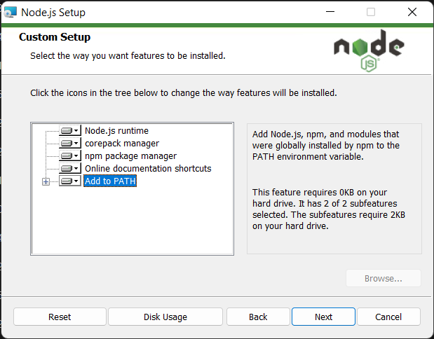

# Install:
**Windows**:
Install node js from `node-v20.11.0-x64.msi` file  
Check that the add to path is checked  


Open cmd and run the following commands:
```bash
cd path_to_vinted_bot
npm install
```

**Linux**:
```bash
cd path_to_vinted_bot
sudo apt-get install nodejs
sudo apt-get install npm
npm install
```

or with nvm:
```bash
cd path_to_vinted_bot
nvm install node
npm install
```


# Run:
Open cmd and run the following commands:
```bash
cd path_to_vinted_bot
node index.js
```